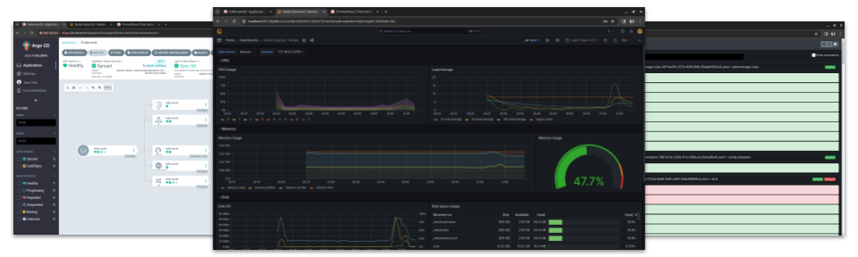
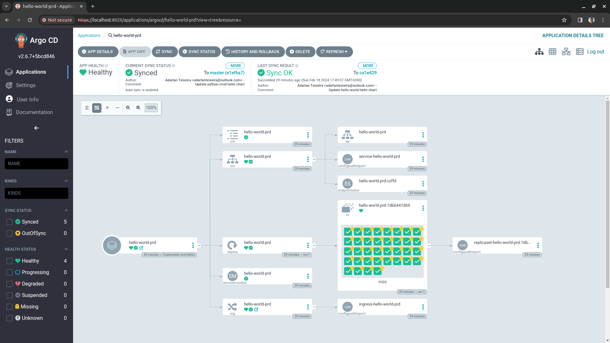
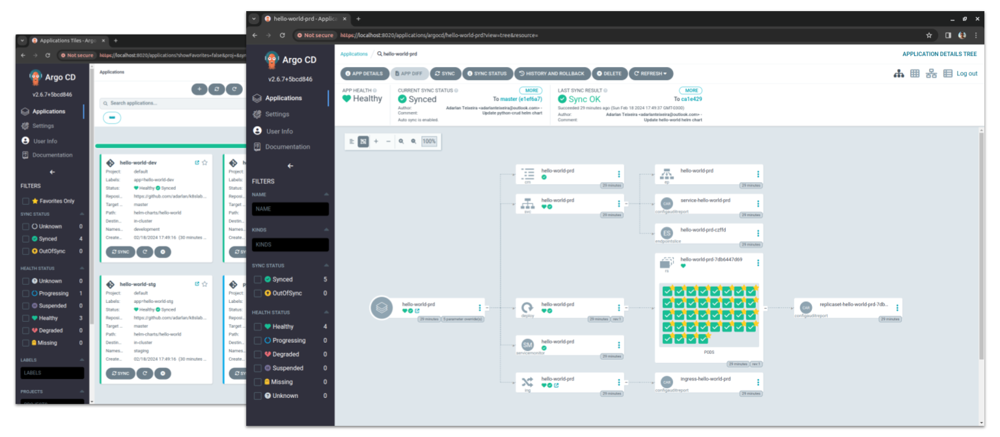

# K8sLab

A collection of IaC modules, CI/CD workflows, and other utilities designed to simplify the provisioning and management of Kubernetes clusters across different environments, including major cloud providers and local setups. It creates a ready-to-use Kubernetes platform bundled with popular open-source tools and example applications.

## Features

- Automated provisioning of [Kubernetes](https://kubernetes.io/) clusters on various cloud providers (e.g., [Amazon EKS](https://aws.amazon.com/eks/)) and local environments using [Kind](https://kind.sigs.k8s.io/)
- Integrated cloud networking across top-tier providers such as [Amazon VPC](https://aws.amazon.com/vpc/)
- Continuous delivery using [Argo CD](https://argoproj.github.io/cd/) for GitOps workflows
- [NGINX Ingress Controller](https://kubernetes.github.io/ingress-nginx/) for managing incoming traffic to the cluster
- [Karpenter](https://karpenter.sh/) for automatic node scaling based on resource usage
- Monitoring and alerting with [Prometheus](https://prometheus.io/) and [Grafana](https://grafana.com/grafana/)
- Package management with [Helm](https://helm.sh/) for deploying Kubernetes rousources
- Infrastructure provisioning with [Terraform](https://www.terraform.io/)
- Continuous integration pipelines using [GitHub Actions](https://github.com/features/actions)
- [Docker](https://www.docker.com/) for containerization of applications

## Quick Start

Get up and running with a local Kubernetes cluster preconfigured with essential tools like Argo CD, NGINX Ingress, Prometheus, Grafana, and more, in just a few simple steps.

Requirements:

- __Terraform__ | https://developer.hashicorp.com/terraform/install
- __Docker Engine__ | https://docs.docker.com/engine/install/
- __Kubectl__ | https://kubernetes.io/docs/tasks/tools/install-kubectl-linux/

### 1. Clone this repository

```shell
git clone https://github.com/adarlan/k8slab.git
```

### 2. Navigate to the local-cluster directory inside the repository

```shell
cd k8slab/local-cluster
```

### 3. Create the local Kubernetes cluster with Terraform

```shell
terraform init
terraform apply -parallelism=1
```

This will create a Kind (Kubernetes-in-Docker) cluster in your local environment.
Additionally, it installs essential Helm charts including `argo-cd`, `ingress-nginx`, `kube-prometheus-stack`, and `trivy-operator` into the cluster.

### 4. Retrieve login information for dashboard access

```shell
terraform output login_info
```

This command provides URLs, usernames, and passwords required to access dashboards and tools installed on the newly-created cluster.

```txt
{
  "argocd" = {
    "password" = "****"
    "url" = "https://localhost:8020"
    "username" = "admin"
  }
  "grafana" = {
    "password" = "****"
    "url" = "http://localhost:8031"
    "username" = "admin"
  }
  "prometheus" = {
    "url" = "http://localhost:8030"
  }
}
```

You can use this information to access insightful dashboards for tools like Argo CD, Prometheus, and Grafana directly from your web browser.



### 5. Configure kubectl to access your cluster

```shell
cp k8slab.kubeconfig ~/.kube/config
```

<!-- TODO merge instead of copy -->

Now you can use `kubectl` to manage your cluster directly from the command line.

```txt
$ kubectl get nodes
NAME                   STATUS   ROLES           AGE     VERSION
k8slab-control-plane   Ready    control-plane   6m25s   v1.29.1
k8slab-worker          Ready    <none>          5m51s   v1.29.1
...
```

### 6. Create the Argo CD applications

Execute the following command to deploy the `hello-world` and `python-crud` applications managed by Argo CD.

```shell
kubectl apply -f ../argocd-apps
```

Open Argo CD in your browser to manage the deployed applications.





### 7. Destroy your cluster

Once you've finished exploring and experimenting with your local Kubernetes environment,
it's important to clean up resources.

```shell
terraform destroy
```

<!-- TODO ## Learn more -->

## Contributing

Contributions are welcome! Feel free to submit issues or pull requests for enhancements, bug fixes, or new features.

## License

This project is licensed under the [Apache 2.0 License](./LICENSE).
